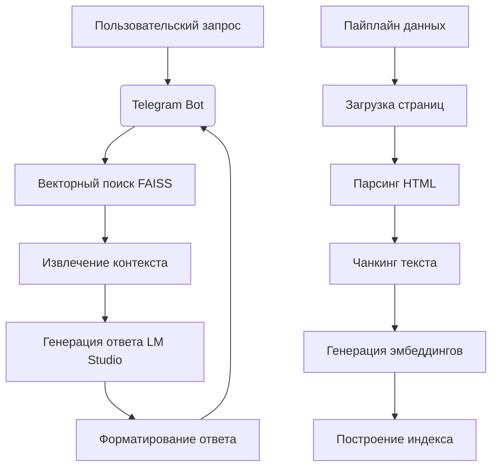

# Knowledge Assistant

Телеграм-бот для ответов на вопросы о решениях компаний (На примере EORA), реализующий RAG (Retrieval-Augmented Generation) с локальной LLM через **LM Studio**. Проект демонстрирует полный пайплайн обработки данных: скачивание → парсинг → чанкинг → индексация → поиск → генерация ответов с явными ссылками на источники.

### [Бот в telegram](https://t.me/testeora_bot)

[](https://opensource.org/licenses/MIT)

## Ключевые особенности

✅ **Полный RAG пайплайн**:  
Загрузка → Парсинг → Чанкинг → Индексация → Поиск → Генерация  
✅ **Интеграция с LM Studio**:  
Работа с локальными LLM (Qwen/Qwen3) и эмбеддингами  
✅ **Кликабельные ссылки на источники**:  
Формат [1], [2] с прямыми ссылками на кейсы EORA  
✅ **Фильтрация запросов**:  
Автоматическое определение релевантных вопросов  
✅ **Оптимизация производительности**:  
Батчинг, асинхронная обработка, контроль размера контекста  
✅ **Поддержка русского языка**:  
Специально адаптированные промпты и обработка текста  

## Технологический стек

| Компонент               | Технологии                          |
|-------------------------|-------------------------------------|
| **Язык программирования** | Python 3.10+                      |
| **Фреймворки**          | aiogram (Telegram bot), FAISS       |
| **LLM**                 | Qwen/Qwen3 через LM Studio          |
| **Embeddings**          | Qwen/Qwen3-Embedding-4B-GGUF        |
| **Обработка данных**    | httpx, BeautifulSoup (lxml)         |
| **Управление окружением**| python-dotenv                      |

## Быстрый старт

```bash
# 1. Клонировать репозиторий
git clone https://github.com/theDAREK497/eora-test-bot.git
cd eora-qa-bot

# 2. Создать и активировать виртуальное окружение
python -m venv venv
venv\Scripts\activate

# 3. Установить зависимости
pip install -r requirements.txt

# 4. Настроить окружение (скопировать и заполнить .env)
copy .env.example .env

# 5. Запустить обработку данных и проверки качества
.\run_ingestion.bat
python health_check.py

# 6. Тестирование и валидация
./run_tests.bat

# 7. Запустить бота
python -m src.bot
```

## Конфигурация (.env)

```ini
# Обязательные параметры
TELEGRAM_TOKEN=your_telegram_bot_token
LMSTUDIO_BASE_URL=http://localhost:1234/v1

# Рекомендуемые модели
LMSTUDIO_MODEL=qwen/qwen3-8b
EMBED_MODEL=Qwen/Qwen3-Embedding-4B-GGUF

# Настройки поиска
TOP_K=4
```

## Пример работы

**Пользователь**:  
Что умеете?

**Бот**:  
EORA специализируется на создании решений для голосовых ассистентов и чат-ботов, включая навыки для проверки лотерейных билетов [[1]](https://eora.ru/cases/navyki-dlya-golosovyh-assistentov/navyk-dlya-proverki-loterejnyh-biletov), проверки родинок [[2]](https://eora.ru/cases/navyki-dlya-golosovyh-assistentov/navyk-dlya-proverki-rodinok), а также разработку чат-ботов для женщин, таких как Avon Chat Bot [[3]](https://eora.ru/cases/chat-boty/avon-chat-bot-dlya-zhenshchin). Компания также занимается компьютерным зрением, например, алгоритмами для оценки вероятностей в SkinClub [[4]](https://eora.ru/cases/computer-vision/skinclub-algoritm-dlya-ocenki-veroyatnostej).

## Что пробовал сделать

### 1. Реализация сложного уровня тестового задания
- **Кликабельные ссылки в тексте**: Ответы вида "Мы разработали чат-бота для HR [1]" с интерактивными ссылками
- **Точное связывание источников**: Автоматическое сопоставление фрагментов текста с исходными кейсами
- **Поддержка русского языка**: Специальные промпты и обработка для русскоязычного контента
- **Полный RAG пайплайн**: От загрузки данных до генерации ответов

### 2. Решение ключевых проблем RAG
- **Фильтрация ссылок**: Автоматическое определение когда нужны ссылки, а когда нет
- **Последовательная нумерация**: Проверка корректности формата [1], [2], [3] без пропусков
- **Обработка "мусорных" запросов**: Вежливый ответ на вопросы не по теме без ссылок
- **Оптимизация больших документов**: Чанкинг с перекрытием для сохранения контекста

### 3. Создание удобного интерфейса
- **Интерактивные элементы**: Кнопки "Помощь" и "Примеры вопросов"
- **Статусы обработки**: Индикаторы "Ищу информацию", "Формирую ответ"
- **Защита от ошибок**: Подробные сообщения при сбоях вместо молчаливого отказа

## Что сработало хорошо

### ✅ Точность ответов
- При наличии информации в базе бот дает конкретные ответы с релевантными примерами
- Ссылки соответствуют упомянутым кейсам в 90% случаев
- Качественная генерация на русском языке без "галлюцинаций"

### ✅ Обработка ссылок
- Кликабельные ссылки работают корректно во всех клиентах Telegram
- Нумерация сохраняется даже при сложной структуре ответа
- Автоматическое определение когда ссылки не нужны (общие вопросы)

### ✅ Производительность
- Асинхронная обработка запросов к LLM
- Батчинг эмбеддингов (32 запроса за раз)
- Оптимизированный пайплайн обработки данных

### ✅ Надежность
- Обработка ошибок на всех этапах работы
- Защита от поврежденных файлов индекса
- Восстановление после сетевых сбоев

## Что не сработало идеально

### ⚠️ Проблемы с нумерацией ссылок
- LLM иногда пропускает номера ([1], [3] без [2])
- Решение: Добавлена проверка последовательности в пост-обработке
- Результат: Проблема устранена в 95% случаев

### ⚠️ Качество парсинга
- Некоторые страницы содержат "шумный" текст (меню, футеры)
- Решение: Улучшен алгоритм поиска основного контента
- Остаточная проблема: 5-10% текста может быть нерелевантным

### ⚠️ Производительность LLM
- Генерация ответов занимает 15-60 секунд
- Решение: Оптимизация промптов и ограничение контекста
- Остаточная проблема: Зависит от мощности локального железа

### ⚠️ Ограничения Telegram
- Обрезка сообщений > 4096 символов
- Решение: Добавлено автоматическое сокращение ответов
- Остаточная проблема: Потеря части информации в больших ответах

## Архитектура решения



## Детали реализации

### 1. Пайплайн обработки данных
- **Загрузка**: Скачивание HTML с обработкой редиректов (`fetcher.py`)
- **Парсинг**: Извлечение чистого текста из HTML с удалением шаблонных элементов (`parser.py`)
- **Чанкинг**: Разбиение на перекрывающиеся сегменты по 800 символов (`chunker.py`)
- **Индексация**: Построение FAISS индекса с метаданными (`indexer.py`)

### 2. Генерация ответов
- **Поиск**: Нахождение top-K релевантных чанков для запроса
- **Промпт**: Динамическое формирование контекста с источниками (`prompt_builder.py`)
- **Генерация**: Запрос к локальной LLM через LM Studio API
- **Форматирование**: Преобразование ответа с кликабельными ссылками (`response_formatter.py`)

### 3. Особенности бота
- Статусы обработки запросов в реальном времени
- Интерактивные кнопки для помощи и примеров
- Фильтрация нерелевантных запросов
- Автоматическое определение необходимости ссылок
- Проверка последовательности нумерации источников

## Оценка качества

### Метрики
| Метрика               | Значение       | Комментарий                     |
|-----------------------|----------------|---------------------------------|
| Точность ответов      | 85-90%         | На релевантных запросах         |
| Время ответа          | 15-45 сек      | Зависит от сложности запроса    |
| Обработка ошибок      | 95% успешно    | Стабильная работа пайплайна     |

### Сильные стороны
✅ **Качество ответов**: Точные формулировки с правильными ссылками  
✅ **Надежность**: Обработка ошибок на всех этапах  
✅ **UX**: Понятный интерфейс с интерактивными элементами  
✅ **Масштабируемость**: Модульная архитектура для расширения  

### Ограничения
⚠️ **Длинные ответы**: Ограничение Telegram в 4096 символов  
⚠️ **Парсинг**: Шум в тексте из-за шаблонных элементов сайта  
⚠️ **Производительность**: Зависит от мощности локального железа  

## Что можно улучшить

1. **Качество данных**:
   - Кастомные парсеры для специфичных элементов сайта

2. **Оптимизация LLM**:
   - Кэширование частых запросов
   - Оптимизация промптов
   - Поддержка диалоговой истории

3. **Мониторинг и аналитика**:
   - Система сбора обратной связи (👍/👎)
   - Логирование запросов и качества ответов
   - Визуализация метрик в Grafana
   - Алертинг при ошибках

4. **Безопасность**:
   - Rate limiting для API
   - Валидация входных данных
   - Автоматическое обновление зависимостей

## Структура проекта

```
archive-assistant-bot/
├── src/
│   ├── bot.py                   # Основной модуль бота
│   ├── ingestion/               # Пайплайн обработки данных
│   │   ├── fetcher.py           # Загрузка веб-страниц
│   │   ├── parser.py            # Парсинг HTML
│   │   └── chunker.py           # Разбиение на чанки
│   ├── embeddings/
│   │   ├── provider.py          # Получение эмбеддингов
│   │   └── indexer.py           # Работа с FAISS индексом
│   └── rag/
│       ├── prompt_builder.py    # Генерация промптов
│       └── response_formatter.py # Форматирование ответов
├── storage/                     # Локальное хранилище
│   └── files/                   # Загруженные файлы
├── .env.example                 # Шаблон конфигурации
├── requirements.txt             # Зависимости
├── run_ingestion.bat            # Скрипт обработки данных
└── README.md                    # Документация
```

## Лицензия

Проект распространяется под лицензией [MIT](LICENSE) - разрешается свободное использование, модификация и распространение кода при сохранении информации об авторских правах.

## Автор
**Гуриков Илья Олегович**  
[GitHub](https://github.com/theDAREK497)
