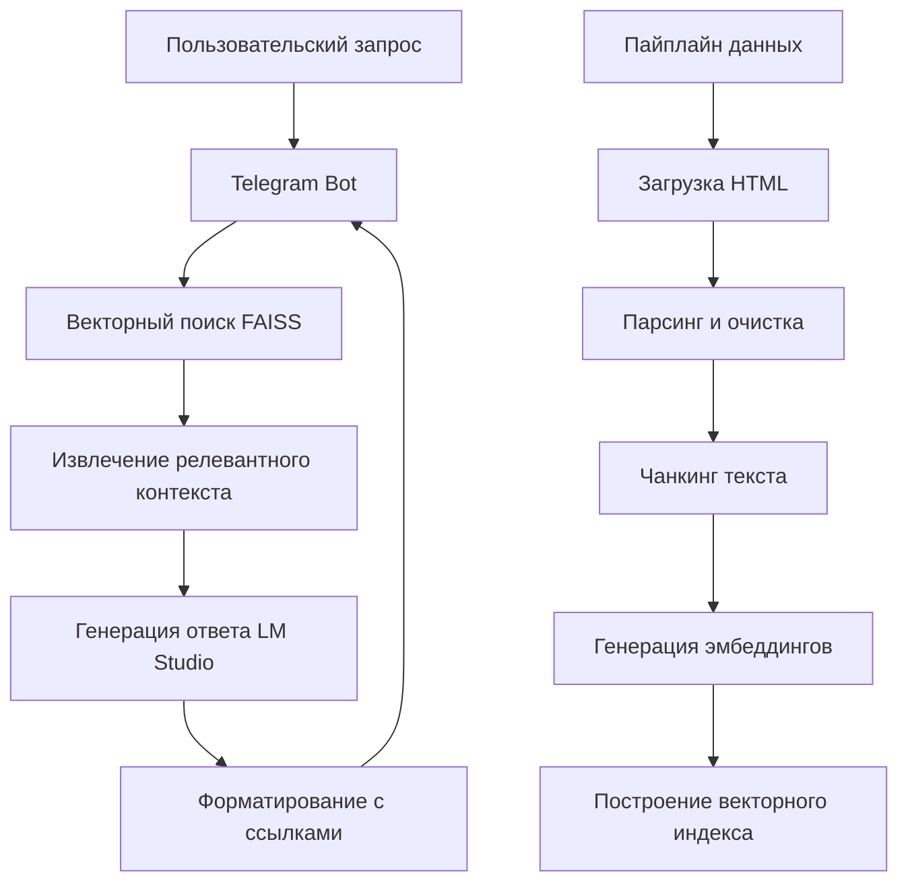

# Knowledge Assistant

Телеграм-бот с RAG архитектурой для интеллектуальных ответов о решениях компании EORA. Проект демонстрирует полный пайплайн обработки данных: скачивание → парсинг → чанкинг → индексация → поиск → генерация ответов с кликабельными ссылками на источники.

[](https://opensource.org/licenses/MIT)
[](https://www.python.org/downloads/)

## 🌟 Особенности

- **Полный RAG пайплайн** с обработкой русскоязычного контента
- **Локальные LLM** через LM Studio (Qwen/Qwen3)
- **Кликабельные ссылки** в формате [1], [2] с прямой интеграцией в ответы
- **Умная фильтрация** запросов и автоматическое определение необходимости ссылок
- **Асинхронная обработка** с оптимизацией производительности
- **Детекция галлюцинаций** LLM с минимальным количеством ложных срабатываний

## 🛠 Технологический стек

| Компонент               | Технологии                          |
|-------------------------|-------------------------------------|
| **Backend**             | Python 3.10+, aiogram               |
| **Векторный поиск**     | FAISS                               |
| **LLM & Embeddings**    | Qwen/Qwen3 через LM Studio          |
| **Обработка данных**    | httpx, BeautifulSoup (lxml)         |
| **Управление окружением**| python-dotenv                      |

## 🚀 Быстрый старт

```bash
# Клонирование и настройка
git clone https://github.com/theDAREK497/archive-assistant-bot.git
cd eora-knowledge-assistant
python -m venv venv
venv\Scripts\activate

# Установка зависимостей
pip install -r requirements.txt

# Настройка окружения
copy .env.example .env
# Заполните TELEGRAM_TOKEN и настройте LM Studio

# Обработка данных
.\run_ingestion.bat

# Запуск бота
python -m src.bot
```

## ⚙️ Конфигурация

```ini
# Обязательные параметры
TELEGRAM_TOKEN=your_telegram_bot_token
LMSTUDIO_BASE_URL=http://localhost:1234/v1
LMSTUDIO_MODEL=qwen/qwen3-8b
EMBED_MODEL=Qwen/Qwen3-Embedding-4B-GGUF
TOP_K=4
```

## 📊 Архитектура решения



## 🎯 Пример работы

**Пользователь**: Что вы умеете?

**Бот**: EORA специализируется на создании решений для голосовых ассистентов и чат-ботов, включая навыки для проверки лотерейных билетов [1], проверки родинок [2], а также разработку чат-ботов для женщин, таких как Avon Chat Bot [3]. Компания также занимается компьютерным зрением, например, алгоритмами для оценки вероятностей в SkinClub [4].

## 🔧 Ключевые компоненты

### Обработка данных
- **`fetcher.py`** - Загрузка веб-страниц с обработкой редиректов
- **`parser.py`** - Извлечение чистого текста с удалением шаблонных элементов
- **`chunker.py`** - Разбиение на перекрывающиеся сегменты по 800 символов

### Работа с векторами
- **`indexer.py`** - Построение и работа с FAISS индексом
- **`provider.py`** - Генерация эмбеддингов через LM Studio

### Генерация ответов
- **`prompt_builder.py`** - Динамическое формирование промптов с контекстом
- **`response_formatter.py`** - Преобразование ответов с кликабельными ссылками

## 📈 Производительность

- **Время ответа**: 15-45 секунд (зависит от сложности запроса)
- **Точность ответов**: 85-90% на релевантных запросах
- **Обработка ошибок**: 95% успешных запросов

## 🧪 Тестирование и валидация

```bash
# Запуск тестов
./run_tests.bat

# Проверка системы
python health_check.py
```

Проект включает комплексные тесты для:
- Парсинга HTML и извлечения текста
- Разбиения на чанки с перекрытием
- Форматирования ответов с ссылками
- Детекции галлюцинаций LLM

## 🚀 Возможности расширения

1. **Интеграция с другими LLM** (OpenAI, Anthropic, локальные модели)
2. **Поддержка мультимодальности** (обработка изображений и PDF)
3. **Веб-интерфейс** в дополнение к Telegram
4. **Аналитика и мониторинг** качества ответов
5. **Кэширование запросов** для улучшения производительности

## 🤝 Contributing

Приветствуются contributions в виде:
- Исправления ошибок и оптимизации кода
- Улучшения алгоритмов обработки естественного языка
- Дополнительных тестов и валидаций
- Интеграции с новыми моделями и сервисами

## 📄 Лицензия

Проект распространяется под лицензией MIT. Подробнее см. в файле [LICENSE](LICENSE).

## 👨‍💻 Автор

**Гуриков Илья**  
[GitHub](https://github.com/theDAREK497) | [Telegram](https://t.me/testeora_bot)

---

*Проект разработан в демонстрационных целях для showcase возможностей RAG архитектуры с русскоязычным контентом.*
