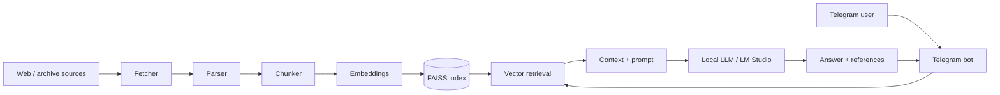

# Archive Assistant Bot


A Telegram-based RAG prototype for answering questions over a document/web archive with **retrieved source references** and a **locally served language model**.

The project demonstrates the complete retrieval pipeline:

**fetch → parse → chunk → embed → index → retrieve → generate → cite**

> **Scope:** portfolio / engineering prototype. It is intended to demonstrate RAG architecture and local-model integration rather than claim production-grade answer accuracy.

## What it demonstrates

- asynchronous Telegram bot workflow with `aiogram`;
- configurable source ingestion;
- HTML fetching and parsing;
- text cleaning and overlapping chunking;
- local embedding generation;
- FAISS vector index;
- retrieval of relevant chunks;
- prompt construction from retrieved context;
- locally served LLMs through LM Studio;
- numbered source references in generated answers;
- health checks and automated tests.

## Architecture


```mermaid
flowchart LR
    Sources[Web / archive sources] --> Fetch[Fetcher]
    Fetch --> Parse[Parser]
    Parse --> Chunk[Chunker]
    Chunk --> Embed[Embeddings]
    Embed --> Index[(FAISS index)]

    User[Telegram user] --> Bot[Telegram bot]
    Bot --> Retrieve[Vector retrieval]
    Index --> Retrieve
    Retrieve --> Prompt[Context + prompt]
    Prompt --> LLM[Local LLM / LM Studio]
    LLM --> Format[Answer + references]
    Format --> Bot
```

## Tech stack

| Area | Technology |
| --- | --- |
| Bot | Python 3.10+, aiogram |
| Retrieval | FAISS |
| LLM / embeddings | OpenAI-compatible local endpoint / LM Studio |
| Fetching | httpx |
| Parsing | BeautifulSoup, lxml |
| Configuration | python-dotenv |
| Testing | Pytest-based test suite + health check |

## Quick start

```bash
git clone https://github.com/theDAREK497/archive-assistant-bot.git
cd archive-assistant-bot

python -m venv venv
```

Windows:

```powershell
venv\Scripts\activate
pip install -r requirements.txt
copy .env.example .env
```

Configure `.env`, start the required models in LM Studio, then build the local index:

```powershell
.\run_ingestion.bat
```

Start the bot:

```bash
python -m src.bot
```

## Configuration

Example settings:

```ini
TELEGRAM_TOKEN=your_telegram_bot_token
LMSTUDIO_BASE_URL=http://localhost:1234/v1
LMSTUDIO_MODEL=qwen/qwen3-8b
EMBED_MODEL=Qwen/Qwen3-Embedding-4B-GGUF
TOP_K=4
```

See `.env.example` for the repository's current configuration template.

## Source ingestion

`sources.txt` defines the source set used by the ingestion pipeline.

The pipeline is split into focused components for fetching, parsing, chunking, embedding and indexing, which makes individual stages easier to test and replace.

## Validation

Run the automated checks:

```powershell
.\run_tests.bat
python health_check.py
```

The test suite covers core retrieval-supporting components such as parsing, chunking and response formatting.

### About answer quality

This repository does **not** publish an artificial single "accuracy percentage." RAG quality depends on the source set, embedding model, retrieval settings, prompt and generation model.

A more rigorous production evaluation would use a versioned question set and measure retrieval relevance, citation correctness, unsupported-answer behaviour and answer quality separately.

## Repository highlights

- `.env.example` — configuration template
- `sources.txt` — ingestion source list
- `src/` — bot and RAG implementation
- `tests/` — automated tests
- `run_ingestion.bat` — local ingestion workflow
- `health_check.py` — environment/system checks

## Possible extensions

- PDF and office-document ingestion;
- reranking;
- hybrid lexical + vector retrieval;
- evaluation dataset and automated retrieval metrics;
- web UI in addition to Telegram;
- alternative OpenAI-compatible providers.

## License

MIT. See [LICENSE](LICENSE).
